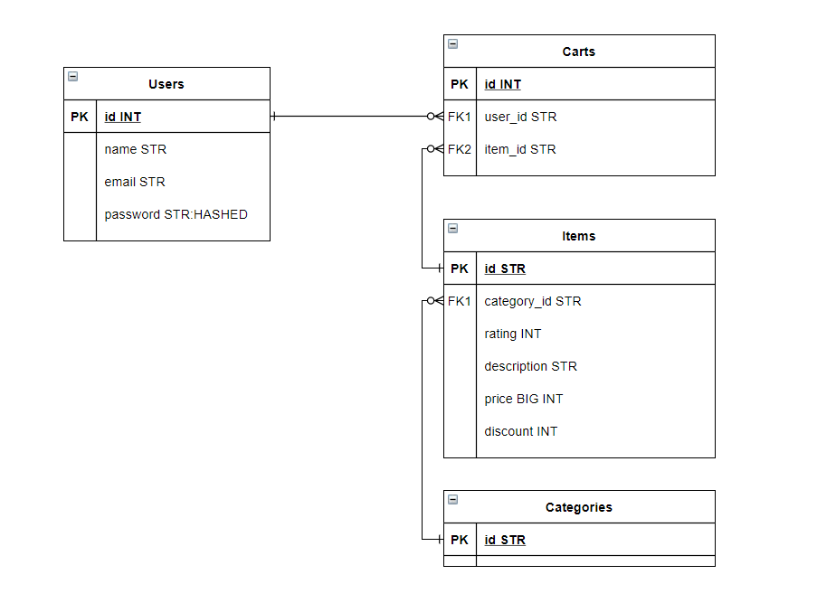

<br />
<p align="center">
  <a href="https://github.com/astriddwrn/aksubFave-teamProject/">
    
  </a>

  <h3 align="center"> Fave Mini Project: Fave Online Shop</h3>

</p>

### Built With
* [Bootstrap](https://getbootstrap.com)
* [JQuery](https://jquery.com)
* [Laravel](https://laravel.com)

### Prerequisites
* XAMPP
* Composer

### Installation

1. Clone the repo
   ```sh
   git clone https://github.com/github_username/repo_name.git
   ```
2. Install composer
   ```sh
   composer install
   ```
3. Set up .env file
   ```sh
    DB_CONNECTION=mysql
    DB_HOST=127.0.0.1
    DB_PORT=3306
    DB_DATABASE=aksubfave-teamproject
    DB_USERNAME=root
    DB_PASSWORD=
   ``` 
4. Start XAMPP Apache and MySQL
5. Create new database in Phpmyadmin named "aksubfave-teamproject"
6. Laravel migrate
    ```sh
   php artisan migrate
   ```
7. Laravel seeder
    ```sh
    php artisan db:seed itemSeeder
    php artisan db:seed pictureSeeder
    php artisan db:seed categorySeeder
   ```
8. Run server
    ```sh
    php artisan serve
    ```
    
### ERD Database

